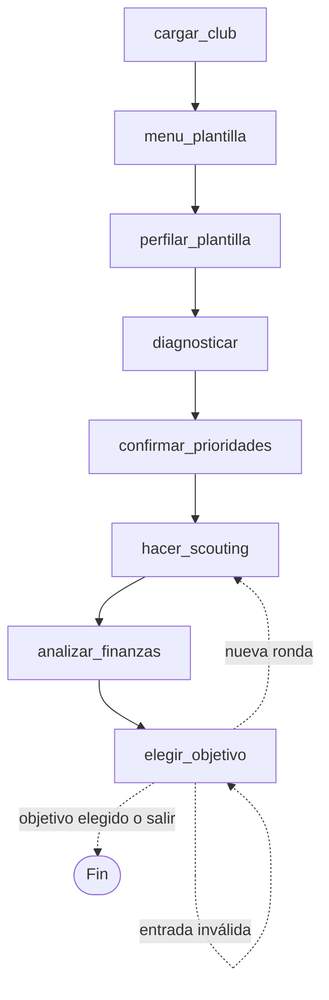

[README.md](https://github.com/user-attachments/files/33136312/README.md)
# TransferAI 

*Curso Agentic AI — Universidad de Los Andes. Autor: Cristian García S.*

## Cómo funciona

Un grafo de **LangGraph** lleva un estado compartido por ocho nodos. Tres agentes usan un modelo de lenguaje (Qwen) y el usuario interviene en tres pausas.



| Parte | Qué hace |
|---|---|
| **Manager Agent** (`diagnosticar`) | Recibe el perfil de la plantilla y entrega un diagnóstico en JSON con hasta 3 posiciones prioritarias. |
| **Scouting Agent** (`hacer_scouting`) | Ciclo pensar-actuar-observar: llama a `buscar_jugadores` y `evaluar_encaje` y propone candidatos de otros clubes. |
| **Financial Agent** (`analizar_finanzas`) | El código calcula si cada candidato es viable, ajustado o inviable según el presupuesto y el margen salarial; el modelo solo redacta un comentario. |
| **Pausas humanas** | `menu_plantilla` (ver plantilla), `confirmar_prioridades` (elegir posiciones) y `elegir_objetivo` (elegir jugador o pedir otra ronda). |

**Principio de diseño: el modelo propone y el código valida.** El modelo solo entrega ids y justificaciones; el código reconstruye cada candidato desde la base de datos, descarta ids o nombres inexistentes y calcula todas las cifras. Cada candidato se clasifica como `mejora_inmediata`, `sucesor_joven`, `promesa` o `no_aporta`, y estos últimos se descartan.

## Estructura del repositorio

| Archivo | Contenido |
|---|---|
| `grafo.py` | Grafo, estado, agentes, validaciones, pausas humanas y punto de entrada. |
| `llm.py` | Conexión con el modelo y ciclo con herramientas. |
| `herramientas.py` | Esquemas de las herramientas del Scouting Agent. |
| `datos.py` | Lectura de los CSV, búsqueda de jugadores, evaluación de encaje y viabilidad financiera. |
| `convertir_datos.py` | Construye `datos_reales/` a partir del dataset de EA FC 24 (opcional). |
| `datos_reales/` | Base de datos usada: 96 clubes y 2.808 jugadores de las cinco grandes ligas (temporada 2023/24). |
| `datos/` | CSV sintéticos de la etapa de pruebas. No se usan en el flujo actual. |
| `.env.example` | Plantilla de variables de entorno. |
| `requirements.txt` | Dependencias. |

1. Copia la plantilla:

   ```bash
   copy .env.example .env      # Windows
   cp .env.example .env        # macOS / Linux

2. Abre `.env` y completa estas tres variables:

   | Variable | Qué poner |
   |---|---|
   | `QWEN_API_KEY` | Tu clave de API. |
   | `QWEN_BASE_URL` | URL base de un endpoint **compatible con el formato de OpenAI**; suele terminar en `/compatible-mode/v1`. |
   | `QWEN_MODEL` | Nombre exacto de un modelo con soporte de **llamadas a herramientas** (*tool calling*). |

   Estos valores se obtienen en la consola de tu proveedor (el proyecto se probó con Qwen en Alibaba Cloud Model Studio). Ejemplo del formato:

   ```
   QWEN_API_KEY=sk-xxxxxxxxxxxxxxxx
   QWEN_BASE_URL=https://tu-endpoint/compatible-mode/v1
   QWEN_MODEL=nombre-del-modelo
   ```

3. Reglas importantes:
   - **Sin comillas ni espacios** alrededor del `=`.
   - La clave y la URL base deben ser **del mismo plan o proveedor**; si no, la API responde con error 401.
   - **Nunca subas el `.env` a GitHub**: ya está en el `.gitignore`. No pegues tu clave en el código, en un chat ni en capturas de pantalla.
   - Si ya tienes definida en tu terminal una variable con el mismo nombre, esa tiene prioridad sobre el `.env`.

## Uso

```bash
python grafo.py
```

Cada sesión pide, en este orden:

| Paso | Qué escribir |
|---|---|
| 1. Club | El nombre completo o parcial, sin importar mayúsculas ni tildes (por ejemplo, `fiorentina` o `atletico`). |
| 2. Menú de plantilla | `1` para ver la plantilla antes de continuar, `2` para ir directo al diagnóstico. |
| 3. Prioridades | Los códigos de las posiciones a reforzar, separados por coma: `POR`, `DFC`, `LAT`, `MED`, `EXT`, `DEL` (por ejemplo, `MED` o `DFC, MED`). |
| 4. Elección del objetivo | El `id` de un candidato de la lista, `nueva` para otra ronda, `nueva: <indicación>` para otra ronda guiada, o `salir`. |

Ejemplos de indicaciones para otra ronda: `nueva: más jóvenes`, `nueva: veteranos`, `nueva: más baratos`, `nueva: promesas con alto potencial`. Solo se pueden cumplir las que se traducen en filtros de búsqueda (edad, valor, rating y potencial). Hay un máximo de **3 rondas** por sesión.

Cada línea `ACTUAR` que aparece durante el scouting es una llamada del agente a una de sus herramientas. Cada ejecución completa hace varias llamadas al modelo y consume cuota de la API.

## Datos

`datos_reales/` ya viene incluida, así que no hace falta descargar nada. Para regenerarla:

1. Descarga `male_players.csv` y `male_teams.csv` del dataset [EA Sports FC 24 Complete Player Dataset](https://www.kaggle.com/datasets/stefanoleone992/ea-sports-fc-24-complete-player-dataset) (Kaggle, dominio público) y colócalos en `datos_originales/`.
2. Ejecuta `python convertir_datos.py`.

El presupuesto de fichajes, el tope salarial y la competición internacional **no existen en el dataset** y son estimaciones de diseño (editables al inicio de `convertir_datos.py`). Los umbrales de edad, rating y viabilidad financiera se editan al inicio de `datos.py`.


